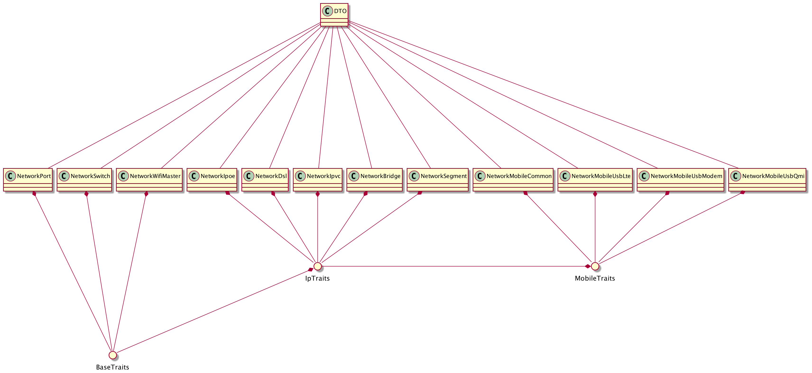

# RFC #000

## Problem

Current complexity of network collection become barrier for onboarding and 
decreasing speed of software development.


## Solution

Change network collection structure from inheritance to composition.




## Impact

- Reduce time to understand network collection
- Reduce tight coupling between entities
- Simplify work with network collection

# To start

```
npm start src/network_base_example.ts
npm start src/network_port_example.ts
```
